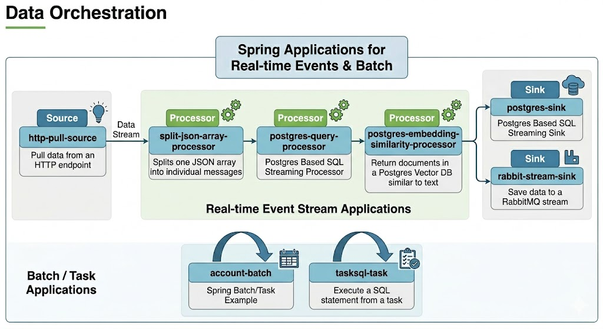

# Spring Cloud Data Flow (SCDF) Data Orchestration Show Case
## Overview

[Spring Cloud Data Flow (SCDF)](https://spring.io/projects/spring-cloud-dataflow) or [Tanzu Data Flow](https://techdocs.broadcom.com/us/en/vmware-tanzu/data-solutions/tanzu-data-flow/2-1/tdf-tanzu/getting-started.html) is a **data integration and orchestration service** for composing, deploying, and managing **data pipelines**.

It provides:
-
- **Streaming pipelines** for event-driven use cases (real-time ETL, messaging, analytics).
- **Task pipelines** for batch or scheduled workloads (machine learning jobs, database migrations, reporting).
- **Application orchestration** across multiple runtimes: Cloud Foundry, Kubernetes, or Local.
- **Scalability** with partitioning, scaling, and monitoring support.

A pipeline in SCDF is built from **Spring Cloud Stream** and **Spring Cloud Task** applications, typically composed of:
- **Source** – Ingests data (e.g., from Kafka, RabbitMQ, HTTP, File, JDBC).
- **Processor** – Transforms or enriches data.
- **Sink** – Writes data to a target system (e.g., database, messaging system, file, analytics store).

---

# Applications

| Type      | Application                                                                                                | Notes                                                                       |
|-----------|------------------------------------------------------------------------------------------------------------|-----------------------------------------------------------------------------|
| Task      | [sql-task](applications/tasks/sql-task)                                                                    | Execute a SQL statement from a task                                         |
| Batch     | [account-batch](applications/batching/db_to_caching/account-batch)                                         | Spring Batch/Task Example                                                   |
| Source    | [http-pull-source](applications/source/http-pull-source)                                                   | Pull data from an HTTP endpoint                                             |
| Processor | [postgres-query-processor](applications/processors/postgres-query-processor)                               | Postgres Based SQL Streaming Processor                                      |
 | Processor | [postgres-embedding-similarity-processor](applications/processors/postgres-embedding-similarity-processor) | Return documents in a Postgres Vector DB that are similar to a text payload |
 | Processor | [split-json-array-processor](applications/processors/split-json-array-processor)                           | Splits one JSON array into individual messages                              |                             
| Sink      | [postgres-sink](applications/sinks/postgres-sink)                                                          | Postgres Based SQL Streaming Sink                                           |
| Sink      | [rabbit-stream-sink](applications/sinks/rabbit-stream-sink)                                                | Save data to a RabbitMQ stream                                              |

# Labs

See [Hands On Labs](docs)

