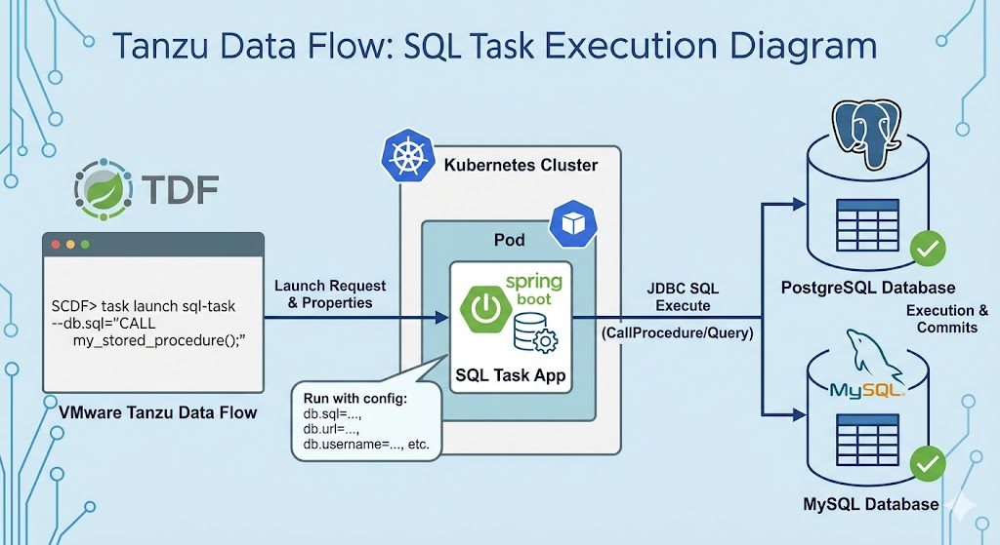
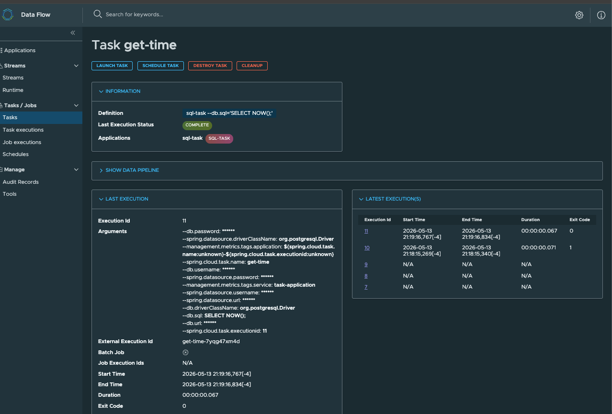

# sql-task


This Spring Cloud Task is a straightforward implementation designed to execute a specific SQL statement against a database (Postgres or MySQL) upon startup. Since it implements ApplicationRunner, the task logic triggers automatically once the Spring Boot application context is fully refreshed.




Configuration
To use this task, you must provide the SQL command and datasource credentials in your configuration file:

## Application Settings

```yaml
spring:
  datasource:
    url: jdbc:postgresql://localhost:5432/mydb
    username: user
    password: password
    driver-class-name: org.postgresql.Driver

# Custom properties mapped to DbProperties class
db:
  url: jdbc:postgresql://localhost:5432/mydb
  username: user
  password: password
  driverClassName: org.postgresql.Driver
  sql: "UPDATE orders SET status = 'PROCESSED' WHERE status = 'PENDING'"
```


## Local Test

Setup Postgres Locally 

Execute [start.sh](../../../deployment/local/podman/postgres/start.sh)
Also  https://www.postgresql.org/

Open Psql 

```shell
podman exec -it postgresql psql -U postgres
```
Create Schema in SQL

```sql
CREATE SCHEMA IF NOT EXISTS accounts;
```

Create Example table

```sql
CREATE TABLE accounts.account_limits (
    account_id TEXT PRIMARY KEY,
    daily_limit_used INTEGER NOT NULL
);
```

Create example Stored Procedure

```sql
CREATE OR REPLACE PROCEDURE accounts.reset_daily_counters()
LANGUAGE plpgsql
AS $$
BEGIN
    -- This runs exactly the same way every time it is called
    UPDATE accounts.account_limits 
    SET daily_limit_used = 0;

    RAISE NOTICE 'All user counters have been reset.';
END;
$$;
```


Insert data into accounts_limits table

```sql
INSERT INTO accounts.account_limits (account_id, daily_limit_used)
VALUES 
    ('ACC001', 50),
    ('ACC002', 120),
    ('ACC003', 0),
    ('ACC004', 450),
    ('ACC005', 10),
    ('ACC006', 85),
    ('ACC007', 300),
    ('ACC008', 25),
    ('ACC009', 0),
    ('ACC010', 500);
```

Run application


```shell
java -jar applications/tasks/sql-task/target/sql-task-0.0.1.jar --spring.datasource.url=jdbc:postgresql://localhost:5432/postgres --spring.datasource.username=postgres --spring.datasource.password= --spring.datasource.driver-class-name=org.postgresql.Driver --db.url=jdbc:postgresql://localhost:5432/postgres --db.username=postgres
--db.password= --db.driverClassName=org.postgresql.Driver --db.sql="call accounts.reset_daily_counters();" --logging.level.org.springframework.jdbc.core=DEBUG
```

Check table results

```sql
select * from accounts.account_limits;
```

Expected Results

```text
postgres=# select * from accounts.account_limits;
 account_id | daily_limit_used 
------------+------------------
 ACC001     |                0
 ACC002     |                0
 ACC003     |                0
 ACC004     |                0
 ACC005     |                0
 ACC006     |                0
 ACC007     |                0
 ACC008     |                0
 ACC009     |                0
 ACC010     |                0
(10 rows)
```

--------------------

# Getting Started on Tanzu Data Flow

Tanzu Data Flow Deployment Guide: SQL Task
This guide provides the necessary configuration to register, launch, and configure the SQL Task on VMware Tanzu Data Flow (SCDF) for Kubernetes.

1. Register the Application
   Before launching the task, you must register the artifact with the SCDF server. Use the appropriate URI based on your environment:

Docker (Kubernetes/Local):

```properties
task.sql-task=docker://cloudnativedata/sql-task:0.0.1
```


Note: You can also use Maven on Tanzu Platform/Private Artifactory  (ex: Properties
task.sql-task=maven://com.github.ggreen:sql-task:0.0.1)

2. Deployment Configuration
   When launching the task via the SCDF Shell or Dashboard, use these properties to connect the task to your target database and define the execution logic.


Deployment property


```properties
app.sql-task.db.url=jdbc:postgresql://postgres-db:5432/postgres-db
app.sql-task.db.driverClassName=org.postgresql.Driver
app.sql-task.db.sql=SELECT NOW();
app.sql-task.db.username=pgappuser
app.sql-task.db.password=PASS
deployer.sql-task.kubernetes.imagePullPolicy=Always
```

