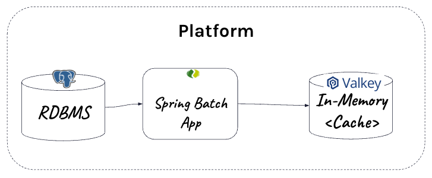

# Batching-Task Introduction





Create podman network (if it does not exist)

```shell
podman network create data-orchestration
```

Start Postgres

```shell
podman run --name postgresql --network data-orchestration --rm  -e POSTGRESQL_USERNAME=postgres -e ALLOW_EMPTY_PASSWORD=true -e POSTGRESQL_DATABASE=postgres -p 5432:5432 bitnami/postgresql:latest 
```


Access PSQL

```shell
podman exec -it postgresql psql -U postgres -d postgres
```

Create Table

```psql
CREATE schema IF NOT EXISTS cache_accounts;

CREATE TABLE cache_accounts.account (
    id text NOT NULL,
    name text NOT NULL,
    first_nm text NULL,
    last_nm text NULL,
    email text NULL,
    phone text NULL,
    PRIMARY KEY (ID)
);

INSERT INTO cache_accounts.account (id, name, first_nm, last_nm, email, phone) VALUES
('1', 'jdoe', 'John', 'Doe', 'jdoe@example.com', '555-123-4567'),
('2', 'asmith', 'Alice', 'Smith', 'asmith@example.com', '555-987-6543'),
('3', 'bwhite', 'Bob', 'White', 'bwhite@example.com', '555-246-1357'),
('4', 'cjones', 'Carol', 'Jones', 'cjones@example.com', '555-864-2097'),
('5', 'dmiller', 'David', 'Miller', 'dmiller@example.com', '555-321-7890'),
('6', 'emartin', 'Emma', 'Martin', 'emartin@example.com', '555-654-0987'),
('7', 'fgarcia', 'Frank', 'Garcia', 'fgarcia@example.com', '555-112-3344'),
('8', 'glopez', 'Grace', 'Lopez', 'glopez@example.com', '555-556-7788'),
('9', 'hking', 'Henry', 'King', 'hking@example.com', '555-889-0011'),
('10', 'iroberts', 'Ivy', 'Roberts', 'iroberts@example.com', '555-223-4455');
```


Start ValKey

```shell
podman run -it --rm \
  --name valkey \
  -p 6379:6379 \
  valkey/valkey:latest
```

- Run RabbitMQ (user/bitnami) - optional
```shell
podman run --name rabbitmq  --rm -e RABBITMQ_MANAGEMENT_ALLOW_WEB_ACCESS=true -p 5672:5672 -p 5552:5552 -p 15672:15672  -p  1883:1883  bitnami/rabbitmq:latest 
```


Start Skipper
```shell
export ROOT_DIR=$PWD
java -jar runtime/scdf/spring-cloud-skipper-server-2.11.5.jar
```


Start Data Flow Server
```shell
export ROOT_DIR=$PWD 
export SPRING_APPLICATION_JSON='{"spring.cloud.stream.binders.rabbitBinder.environment.spring.rabbitmq.username":"user","spring.cloud.stream.binders.rabbitBinder.environment.spring.rabbitmq.password":"bitnami","spring.rabbitmq.username":"user","spring.rabbitmq.password":"bitnami","spring.cloud.dataflow.applicationProperties.stream.spring.rabbitmq.username" :"user","spring.cloud.dataflow.applicationProperties.stream.spring.rabbitmq.password" :"bitnami"}'

java -jar runtime/scdf/spring-cloud-dataflow-server-2.11.5.jar
```


## Running the accounts

Generate Register Script

```shell
mkdir -p runtime/scripts
echo app register --name account-batch --type task --bootVersion 3 --uri file://$PWD/applications/batching/db_to_caching/account-batch/target/account-batch-0.0.1-SNAPSHOT.jar > runtime/scripts/account-batch.shell
cat runtime/scripts/account-batch.shell
```


Register Account Batch

```shell
java -jar runtime/scdf/spring-cloud-dataflow-shell-2.11.5.jar --dataflow.uri=http://localhost:9393 --spring.shell.commandFile=runtime/scripts/account-batch.shell
````

View Task

Click Type -> Task

```shell
open http://localhost:9393/dashboard/index.html#/apps
```

## Launch Job

The following is an example DSL to run the batch in Spring Cloud DataFlow


Open Tasks

```shell
open http://localhost:9393/dashboard/index.html#/tasks-jobs/tasks
```

Click Create Task

```shell
account-batch --spring.profiles.active=postgres  --db.schema=cache_accounts --spring.data.redis.host="localhost" --spring.data.redis.port=6379 --batch.jdbc.url="jdbc:postgresql://localhost:5432/postgres"  --batch.jdbc.username=postgres --spring.sql.init.platform=postgres --batch.job.repository.create=true --batch.load.accounts=true --account.data.count=10000  --account.data.batch.size=50 
```

name=db_to_caching

Click Launch

View Job Executions

```shell
http://localhost:9393/dashboard/index.html#/tasks-jobs/job-executions
```


## Review Source Data in Postgres

1. Access Psql

```shell
podman exec -it postgresql psql -U postgres -d postgres
```

2. Select Source Data

```psql
select * from cache_accounts.account;
```

## Review Target Results in Postgres

1. Access Valkey

```shell
podman exec -it valkey valkey-cli
```
2. Look at all keys

Once inside the CLI:

```valkey-cli
keys *
```

3. Inspect a string value

If you know the key is a string:


```valkey-cli
HGETALL "spring.gemfire.showcase.account.domain.account.Account:1"
```


-----------------------
# Tear Down

- Stop Data Flow Server (Control C)
- Stop SKipper (Control C)

Stop Services

```shell
podman rm -f rabbitmq valkey postgresql
```