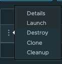

# Batching-Task Introduction


Create podman network (if it does not exist)

```shell
podman network create data-orchestration
```

Start Postgres

```shell
./deployment/local/podman/postgres/start.sh 
```


- Run RabbitMQ (guest/guest) - optional
```shell
./deployment/local/podman/rabbit/start.sh 
```


Start Skipper (if not running)
```shell
deployment/local/dataflow/start-skipper.sh
```


Start Data Flow Server (if not running)
```shell
deployment/local/dataflow/start-df-server.sh
```

Access PSQL

```shell
podman exec -it postgresql psql -U postgres -d postgres
```

Create Table

```psql
CREATE schema IF NOT EXISTS cache_accounts;

CREATE TABLE cache_accounts.account (
    id text NOT NULL,
    name text NOT NULL,
    first_nm text NULL,
    last_nm text NULL,
    email text NULL,
    phone text NULL,
    PRIMARY KEY (ID)
);

INSERT INTO cache_accounts.account (id, name, first_nm, last_nm, email, phone) VALUES
('1', 'jdoe', 'John', 'Doe', 'jdoe@example.com', '555-123-4567'),
('2', 'asmith', 'Alice', 'Smith', 'asmith@example.com', '555-987-6543'),
('3', 'bwhite', 'Bob', 'White', 'bwhite@example.com', '555-246-1357'),
('4', 'cjones', 'Carol', 'Jones', 'cjones@example.com', '555-864-2097'),
('5', 'dmiller', 'David', 'Miller', 'dmiller@example.com', '555-321-7890'),
('6', 'emartin', 'Emma', 'Martin', 'emartin@example.com', '555-654-0987'),
('7', 'fgarcia', 'Frank', 'Garcia', 'fgarcia@example.com', '555-112-3344'),
('8', 'glopez', 'Grace', 'Lopez', 'glopez@example.com', '555-556-7788'),
('9', 'hking', 'Henry', 'King', 'hking@example.com', '555-889-0011'),
('10', 'iroberts', 'Ivy', 'Roberts', 'iroberts@example.com', '555-223-4455');
```


Start ValKey

```shell
./deployment/local/podman/valkey/start.sh
```


# Building Project

Download (first time only)
```shell
git clone https://github.com/ggreen/data-orchestration-with-scdf-showcase.git
cd data-orchestration-with-scdf-showcase
```

Build (first time only)

```shell
mvn -Dmaven.test.skip=true package
```

## Running the accounts

Generate Register Script

```shell
mkdir -p runtime/scripts
echo app register --name account-batch --type task --bootVersion 3 --uri file://$PWD/applications/batching/db_to_caching/account-batch/target/account-batch-0.0.1-SNAPSHOT.jar > runtime/scripts/account-batch.shell
cat runtime/scripts/account-batch.shell
```


Register Account Batch

NOTE: Please make sure to adjust the path to scdf jar or account-batch.shell file if your running in errors with registering the application

```shell
java -jar runtime/scdf/spring-cloud-dataflow-shell-2.11.5.jar --dataflow.uri=http://localhost:9393 --spring.shell.commandFile=runtime/scripts/account-batch.shell
````

View Task

Click Type -> Task

```shell
open http://localhost:9393/dashboard/index.html#/apps
```

## Launch Job

The following is an example DSL to run the batch in Spring Cloud DataFlow


Click Tasks

```shell
open http://localhost:9393/dashboard/index.html#/tasks-jobs/tasks
```

Click Create Task

```shell
account-batch --spring.profiles.active=postgres  --db.schema=cache_accounts --spring.data.redis.host="localhost" --spring.data.redis.port=6379 --batch.jdbc.url="jdbc:postgresql://localhost:5432/postgres"  --batch.jdbc.username=postgres --spring.sql.init.platform=postgres --batch.job.repository.create=true --batch.load.accounts=true --account.data.count=10000  --account.data.batch.size=50 
```

name=db_to_caching

Click Launch



View Job Executions

Click Job executions 

```shell
http://localhost:9393/dashboard/index.html#/tasks-jobs/job-executions
```


## Review Source Data in Postgres

1. Access Psql

```shell
podman exec -it postgresql psql -U postgres -d postgres
```

2. Select Source Data

```psql
select * from cache_accounts.account;
```

## Review Target Results in Valkey

1. Access Valkey

```shell
podman exec -it valkey valkey-cli
```
2. Look at all keys

Once inside the CLI:

```valkey-cli
keys *
```

3. Inspect a  value

Get HASH data using the key 


```valkey-cli
HGETALL "spring.gemfire.showcase.account.domain.account.Account:1"
```

Type in valkey-cli 
```shell
exit
```

Type in psql
```shell
exit
```


-----------------------
# Tear Down (optional)

- Stop Data Flow Server (Control C)
- Stop Skipper (Control C)

Stop Services

```shell
podman rm -f rabbitmq valkey postgresql
```


# Troubleshooting

- Application failed to compile when running **"mvn -Dmaven.test.skip=true clean package"**

Make sure to setup JAVA_HOME to point to jdk17
```
export JAVA_HOME=/opt/homebrew/opt/openjdk@17
```