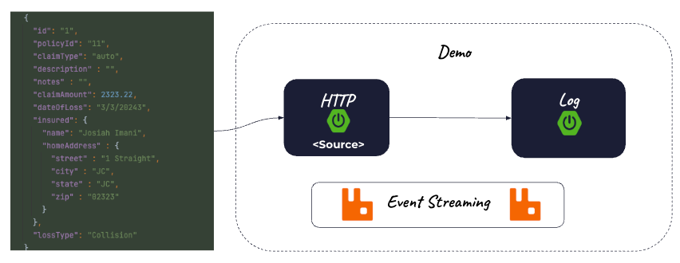
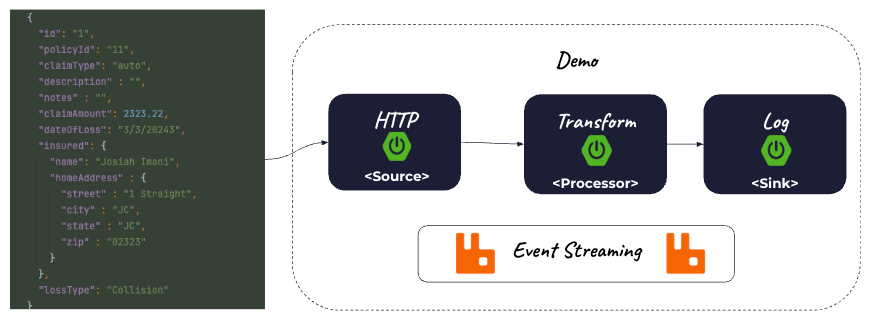
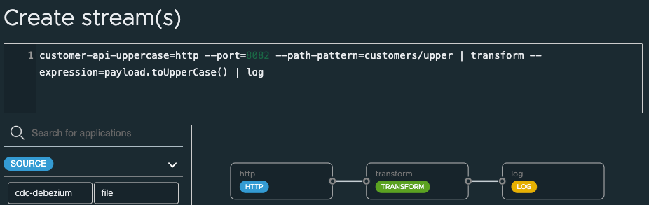

#  Streaming Introduction



- Run RabbitMQ (user/bitnami)
```shell
podman run --name rabbitmq  --rm -e RABBITMQ_MANAGEMENT_ALLOW_WEB_ACCESS=true -p 5672:5672 -p 5552:5552 -p 15672:15672  -p  1883:1883  bitnami/rabbitmq:4.0.4 
```


Start Skipper
```shell
export ROOT_DIR=$PWD
java -jar runtime/scdf/spring-cloud-skipper-server-2.11.5.jar
```


Start Data Flow Server
```shell
export ROOT_DIR=$PWD 
export SPRING_APPLICATION_JSON='{"spring.cloud.stream.binders.rabbitBinder.environment.spring.rabbitmq.username":"user","spring.cloud.stream.binders.rabbitBinder.environment.spring.rabbitmq.password":"bitnami","spring.rabbitmq.username":"user","spring.rabbitmq.password":"bitnami","spring.cloud.dataflow.applicationProperties.stream.spring.rabbitmq.username" :"user","spring.cloud.dataflow.applicationProperties.stream.spring.rabbitmq.password" :"bitnami"}'

java -jar runtime/scdf/spring-cloud-dataflow-server-2.11.5.jar
```

## HTTP Log Stream Pipeline


Open Dashboard

```shell
open http://localhost:9393/dashboard/index.html#/streams/list
```


- Click Create Stream(s)
- Paste Definition

```scdf
http-api=http --port=8081 --path-pattern=customers | log
```


- Create Stream 
- Deploy the Stream


## Testing

Example JJSON

```json

{
  "firstName" : "Josiah",
  "lastName" : "Imani",
  "email" : "email@email",
  "phone" : "555-555-5555",
  "address" : "12 Straight St",
  "city" : "gold",
  "zip": "55555"
}

```


Post to HTTP source

```shell
curl -X 'POST' \
  'http://localhost:8081/customers' \
  -H 'accept: */*' \
  -H 'Content-Type: application/json' \
  -d '{
  "firstName" : "Josiah",
  "lastName" : "Imani",
  "email" : "email@email",
  "phone" : "555-555-5555",
  "address" : "12 Straight St",
  "city" : "gold",
  "state" "ny",
  "zip": "55555"
}'
```

View Logs output in dashboard

-------------
## Upper Case Stream

 

Open Dashboard

```shell
open http://localhost:9393/dashboard/index.html#/streams/list
```

- Click Create Stream(s)
- Paste Definition


```shell
customer-api-uppercase=http --port=8082 --path-pattern=customers/upper | transform --expression=payload.toUpperCase() | log
```

- Click Create Stream




- Deploy Stream
- 


### Testing Stream


```shell
curl -X 'POST' \
  'http://localhost:8082/customers/upper' \
  -H 'accept: */*' \
  -H 'Content-Type: application/json' \
  -d '{
  "firstName" : "Josiah",
  "lastName" : "Imani",
  "email" : "email@email",
  "phone" : "555-555-5555",
  "address" : "12 Straight St",
  "city" : "gold",
  "state" "ny",
  "zip": "55555"
}'
```


View Logs output in dashboard

-----------------------
# Tear Down

- Stop Data Flow Server (Control C)
- Stop SKipper (Control C)

Stop Services

```shell
podman rm -f rabbitmq
```