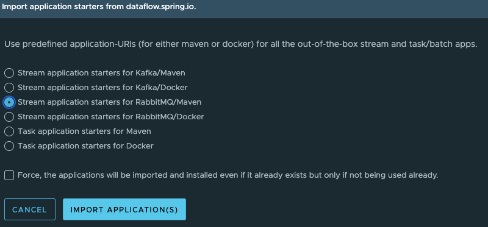
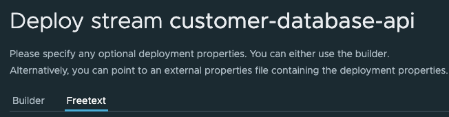

# HTTP API to JDBC Stream


```shell
podman network create data-orchestration
```

## Start RabbitMQ

- Run RabbitMQ (user/bitnami)
```shell
podman run --name rabbitmq  --rm -e RABBITMQ_MANAGEMENT_ALLOW_WEB_ACCESS=true -p 5672:5672 -p 5552:5552 -p 15672:15672  -p  1883:1883  bitnami/rabbitmq:latest 
```


## Postgres

```shell
podman run --name postgresql --network data-orchestration --rm  -e POSTGRESQL_USERNAME=postgres -e ALLOW_EMPTY_PASSWORD=true -e POSTGRESQL_DATABASE=postgres -p 5432:5432 bitnami/postgresql:latest 
```

# Start SCDF


Start Skipper
```shell
export ROOT_DIR=$PWD
export SPRING_APPLICATION_JSON='{"spring.datasource.username" : "postgres","spring.datasource.url": "jdbc:postgresql://localhost/postgres"}'
java -jar runtime/scdf/spring-cloud-skipper-server-2.11.5.jar
```


Start Data Flow Server
```shell
export ROOT_DIR=$PWD
export SPRING_APPLICATION_JSON='{"spring.cloud.stream.binders.rabbitBinder.environment.spring.rabbitmq.username":"user","spring.cloud.stream.binders.rabbitBinder.environment.spring.rabbitmq.password":"bitnami","spring.rabbitmq.username":"user","spring.rabbitmq.password":"bitnami","spring.cloud.dataflow.applicationProperties.stream.spring.rabbitmq.username" :"user","spring.cloud.dataflow.applicationProperties.stream.spring.rabbitmq.password" :"bitnami", "spring.datasource.username" : "postgres","spring.datasource.url": "jdbc:postgresql://localhost/postgres","spring.datasource.driverClassName": "org.postgresql.Driver"}'

java -jar runtime/scdf/spring-cloud-dataflow-server-2.11.5.jar
```


## PSQL

```shell
podman run --name psql -it --rm \
--network data-orchestration \
    bitnami/postgresql:latest psql -h postgresql -U postgres
```


```sql
SELECT usename, application_name,client_addr FROM pg_stat_activity;
```


```sql

create schema IF NOT EXISTS customer;

create table customer.customers(
email text NOT NULL,
first_nm text NOT NULL,
last_nm text  NOT NULL,
phone text ,
address text NOT NULL,
city text ,
state text ,
zip text NOT NULL,
 PRIMARY KEY (email)
);

```

Open SCDF Dashboar


```shell
open http://localhost:9393/dashboard/index.html#/apps
```

Import RabbitMQ applications from Maven

- Click Add Applications




Open Streams

```shell
open http://localhost:9393/dashboard/index.html#/streams/list
```

Click Create Stream

- Paste Definition

```shell
customer-database-api=http --port=8084 --path-pattern=customers | jdbc --columns=first_nm:firstName,last_nm:lastName,email,phone,address,city,state,zip --table-name=customer.customers
```


Create Stream

Deploy the team


Click Deploy -> Free Text




Paste the following properties

```properties
app.http.path-pattern=customers
app.http.server.port=8084
app.jdbc.consumer.columns=first_nm:firstName,last_nm:lastName,email,phone,address,city,state,zip
app.jdbc.consumer.table-name=customer.customers
app.jdbc.spring.datasource.username=postgres
app.jdbc.spring.datasource.url="jdbc:postgresql://localhost/postgres"
app.jdbc.spring.datasource.driverClassName=org.postgresql.Driver
```


## Testing


Submit Customer Data

```shell
curl -X 'POST' \
  'http://localhost:8084/customers' \
  -H 'accept: */*' \
  -H 'Content-Type: application/json' \
  -d '{
  "firstName" : "Josiah",
  "lastName" : "Imani",
  "email" : "email@email",
  "phone" : "555-555-5555",
  "address" : "12 Straight St",
  "city" : "gold",
  "state": "ny",
  "zip": "55555"
}'
```


Select Data in Psql

```sql
select * from customer.customers;
```

Post Customer

```shell
curl -X 'POST' \
  'http://localhost:8084/customers' \
  -H 'accept: */*' \
  -H 'Content-Type: application/json' \
  -d '{
  "firstName" : "Jill",
  "lastName" : "Smith",
  "email" : "jsmith@email",
  "phone" : "155-555-5555",
  "address" : "2 Straight St",
  "city" : "gold",
  "state": "ny",
  "zip": "55555"
}'
```

Select Results in psql
```sql
select * from customer.customers;
```

Post Customer

```shell
curl -X 'POST' \
  'http://localhost:8084/customers' \
  -H 'accept: */*' \
  -H 'Content-Type: application/json' \
  -d '{
  "firstName" : "Jack",
  "lastName" : "Smith",
  "email" : "jacksmith@email",
  "phone" : "255-555-5555",
  "address" : "255 Straight St",
  "city" : "gold",
  "state": "ny",
  "zip": "55555"
}'
```

Select Data in PSQL

```sql
select * from customer.customers;

```
Change Jill Smith Phone (ERROR)

```shell
curl -X 'POST' \
  'http://localhost:8084/customers' \
  -H 'accept: */*' \
  -H 'Content-Type: application/json' \
  -d '{
  "firstName" : "Jill",
  "lastName" : "Smith",
  "email" : "jsmith@email",
  "phone" : "222-555-5555",
  "address" : "2 Straight St",
  "city" : "gold",
  "state": "ny",
  "zip": "55555"
}'
```

Phone number not changed
```sql
select * from customer.customers;

```


See JDBC Logs in SCDF Dashboard

```text
ERROR: duplicate key value violates unique constraint "customers_pkey"
  Detail: Key (email)=(jsmith@email) already exists.
```


-----------------------
# Tear Down

- Stop Data Flow Server (Control C)
- Stop SKipper (Control C)

Stop Services

```shell
podman rm -f rabbitmq postgresql
```