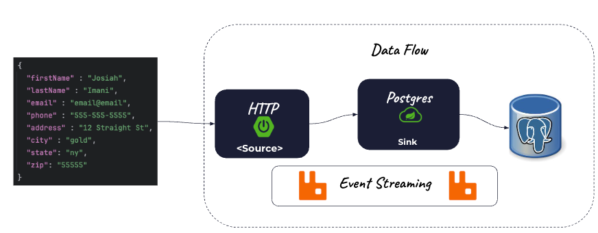
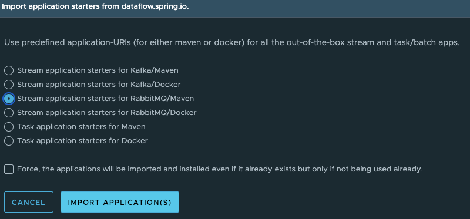
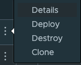

# HTTP API to Postgres Stream




# Building Project

Download (first time only)
```shell
git clone https://github.com/ggreen/data-orchestration-with-scdf-showcase.git
cd data-orchestration-with-scdf-showcase
```

Build (first time only)

```shell
mvn -Dmaven.test.skip=true package
```

Create podman network (if it does not exist)

```shell
podman network create data-orchestration
```

- Run RabbitMQ (guest/guest) if not running
```shell
deployment/local/podman/rabbit/start.sh 
```

Start if not running

```shell
./deployment/local/podman/postgres/start.sh  
```


Start Skipper (if not running)
```shell
deployment/local/dataflow/start-skipper.sh
```


Start Data Flow Server (if not running)
```shell
deployment/local/dataflow/start-df-server.sh
```


--------

Run psql

```shell
podman exec -it postgresql psql -U postgres -d postgres
```


```sql
drop schema customer CASCADE;

create schema IF NOT EXISTS customer;

create table customer.customers(
first_nm text NOT NULL,
last_nm text  NOT NULL,
email text NOT NULL,
phone text ,
address text NOT NULL,
city text ,
state text ,
zip text NOT NULL,
 PRIMARY KEY (email)
);

```


Open SCDF Dashboard


```shell
open http://localhost:9393/dashboard/index.html#/apps
```

Import RabbitMQ applications from Maven

- Click Add Applications




Build application

```shell
mvn package
```


Generate Register Script

```shell
mkdir -p runtime/scripts
echo app register --name postgres --type sink --bootVersion 3 --uri file://$PWD/applications/sinks/postgres-sink/target/postgres-sink-0.0.1-SNAPSHOT.jar > runtime/scripts/postgres-sink-register.shell
cat runtime/scripts/postgres-sink-register.shell
```


Register Sink

```shell
java -jar runtime/scdf/spring-cloud-dataflow-shell-2.11.5.jar --dataflow.uri=http://localhost:9393 --spring.shell.commandFile=runtime/scripts/postgres-sink-register.shell
````

Open dashboard

```shell
open http://localhost:9393/dashboard/index.html#/streams/list
```


Create Stream

- Use the following definition

```shell
customer-postgres-api=http --port=8090 --path-pattern=customers | postgres
```

Deploy the steam



Click FreeText


Paste the following

```properties
app.http.path-pattern=customers
app.http.server.port=8090
app.postgres.sql.consumer.sql="insert into customer.customers(email,first_nm,last_nm,phone,address,city,state,zip) values (:email,:firstName,:lastName,:phone, :address,:city,:state,:zip) on CONFLICT (email) DO UPDATE SET first_nm = :firstName, last_nm = :lastName,  phone = :phone, address = :address, city = :city, state = :state, zip = :zip"
app.postgres.spring.datasource.username=postgres
app.postgres.spring.datasource.url="jdbc:postgresql://localhost/postgres"
app.postgres.spring.datasource.driverClassName=org.postgresql.Driver
```


## Testing


```shell
curl -X 'POST' \
  'http://localhost:8090/customers' \
  -H 'accept: */*' \
  -H 'Content-Type: application/json' \
  -d '{
  "email" : "email@email",
  "firstName" : "Josiah",
  "lastName" : "Imani",
  "phone" : "555-555-5555",
  "address" : "12 Straight St",
  "city" : "gold",
  "state": "ny",
  "zip": "55555"
}'
```


In psql 

```sql
select * from customer.customers;

```

Insert

```shell
curl -X 'POST' \
  'http://localhost:8090/customers' \
  -H 'accept: */*' \
  -H 'Content-Type: application/json' \
  -d '{
  "firstName" : "Jill",
  "lastName" : "Smith",
  "email" : "jsmith@email",
  "phone" : "155-555-5555",
  "address" : "2 Straight St",
  "city" : "gold",
  "state": "ny",
  "zip": "55555"
}'
```
```sql
select * from customer.customers;
```


Update Jill's phone

```shell
curl -X 'POST' \
  'http://localhost:8090/customers' \
  -H 'accept: */*' \
  -H 'Content-Type: application/json' \
  -d '{
  "firstName" : "Jill",
  "lastName" : "Smith",
  "email" : "jsmith@email",
  "phone" : "222-222-2222",
  "address" : "2 Straight St",
  "city" : "gold",
  "state": "ny",
  "zip": "55555"
}'
```

Select data in PSQL

```sql
select * from customer.customers;

```

Insert Data 

```shell
curl -X 'POST' \
  'http://localhost:8090/customers' \
  -H 'accept: */*' \
  -H 'Content-Type: application/json' \
  -d '{
  "firstName" : "Jack",
  "lastName" : "Smith",
  "email" : "jacksmith@email",
  "phone" : "255-555-5555",
  "address" : "255 Straight St",
  "city" : "gold",
  "state": "ny",
  "zip": "55555"
}'
```

Select Data in psql

```sql
select * from customer.customers;

```
Change Jack Smith's Information

```shell
curl -X 'POST' \
  'http://localhost:8090/customers' \
  -H 'accept: */*' \
  -H 'Content-Type: application/json' \
  -d '{
  "firstName" : "Jack",
  "lastName" : "Smith",
  "email" : "jacksmith@email",
  "phone" : "255-555-5555",
  "address" : "333 Straight St",
  "city" : "silver",
  "state": "ny",
  "zip": "23232"
}'
```

Type in psql
```shell
exit
```

-----------------------
# Tear Down

- Stop Data Flow Server (Control C)
- Stop SKipper (Control C)

Stop Services

```shell
podman rm -f rabbitmq postgresml postgresql
```