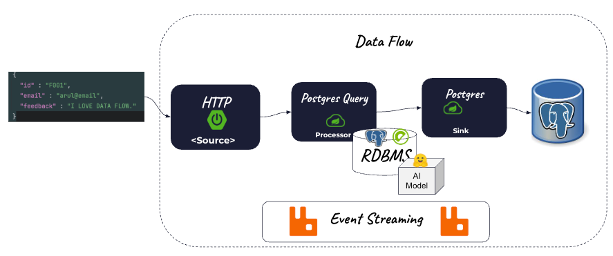

# HTTP to SQL AI to Postgres




# Building Project

Download (first time only)
```shell
git clone https://github.com/ggreen/data-orchestration-with-scdf-showcase.git
cd data-orchestration-with-scdf-showcase
```

Build (first time only)

```shell
mvn -Dmaven.test.skip=true package
```

Create podman network (if it does not exist)

```shell
podman network create data-orchestration
```

Run Rabbit

```shell
podman run --name rabbitmq  --rm -e RABBITMQ_MANAGEMENT_ALLOW_WEB_ACCESS=true -p 5672:5672 -p 5552:5552 -p 15672:15672  -p  1883:1883  bitnami/rabbitmq:4.0.4 
```

Run Postgres

```shell
podman run --name postgresql --network data-orchestration --rm  -e POSTGRESQL_USERNAME=postgres -e ALLOW_EMPTY_PASSWORD=true -e POSTGRESQL_DATABASE=postgres -p 5432:5432 bitnami/postgresql:latest 
```

Run PostgresML

```shell
podman run --rm --name postgresml \
    -it \
    --network data-orchestration  \
    -v postgresml_data:/var/lib/postgresql \
    -p 6432:5432 \
    -p 8000:8000 \
    ghcr.io/postgresml/postgresml:2.10.0 \
    sudo -u postgresml psql -d postgresml
```


```shell
podman run --name psql -it --rm \
--network data-orchestration \
    bitnami/postgresql:latest psql -h postgresml  -U postgres -d postgresml
```


```shell
create  schema  if not exists customer ;

create table customer.feedback(
    feed_id text NOT NULL,
    email text NOT NULL,
    user_feedback text NOT NULL,
    feedback_dt timestamp NOT NULL DEFAULT NOW(),
    sentiment smallint NOT NULL,
    score numeric NOT NULL,
 PRIMARY KEY (feed_id)
);
```


Start Skipper

```shell
export ROOT_DIR=$PWD
export SPRING_APPLICATION_JSON='{"spring.datasource.username" : "postgres","spring.datasource.url": "jdbc:postgresql://localhost/postgres"}'
java -jar runtime/scdf/spring-cloud-skipper-server-2.11.5.jar
```


Start Data Flow Server
```shell
export ROOT_DIR=$PWD
export SPRING_APPLICATION_JSON='{"spring.cloud.stream.binders.rabbitBinder.environment.spring.rabbitmq.username":"user","spring.cloud.stream.binders.rabbitBinder.environment.spring.rabbitmq.password":"bitnami","spring.rabbitmq.username":"user","spring.rabbitmq.password":"bitnami","spring.cloud.dataflow.applicationProperties.stream.spring.rabbitmq.username" :"user","spring.cloud.dataflow.applicationProperties.stream.spring.rabbitmq.password" :"bitnami", "spring.datasource.username" : "postgres","spring.datasource.url": "jdbc:postgresql://localhost/postgres","spring.datasource.driverClassName": "org.postgresql.Driver"}'

java -jar runtime/scdf/spring-cloud-dataflow-server-2.11.5.jar
```

---------------------------

Register Apps

Generate Register Script

```shell
mkdir -p runtime/scripts
echo app register --name postgres --type sink --bootVersion 3 --uri file://$PWD/applications/sinks/postgres-sink/target/postgres-sink-0.0.1-SNAPSHOT.jar --metadataUri file://$PWD/applications/sinks/postgres-sink/target/postgres-sink-0.0.1-SNAPSHOT-metadata.jar > runtime/scripts/postgres-sink-register.shell
cat runtime/scripts/postgres-sink-register.shell
```

Register Sink

```shell
java -jar runtime/scdf/spring-cloud-dataflow-shell-2.11.5.jar --dataflow.uri=http://localhost:9393 --spring.shell.commandFile=runtime/scripts/postgres-sink-register.shell
````


Generate Register Script

```shell
mkdir -p runtime/scripts
echo app register --name postgres-query --type processor --bootVersion 3 --uri file://$PWD/applications/processors/postgres-query-processor/target/postgres-query-processor-0.0.1-SNAPSHOT.jar  --metadataUri file://$PWD/applications/processors/postgres-query-processor/target/postgres-query-processor-0.0.1-SNAPSHOT-metadata.jar > runtime/scripts/postgres-query-processor.shell
cat runtime/scripts/postgres-query-processor.shell
```


Register App

```shell
java -jar runtime/scdf/spring-cloud-dataflow-shell-2.11.5.jar --dataflow.uri=http://localhost:9393 --spring.shell.commandFile=runtime/scripts/postgres-query-processor.shell
````
Open SCDF Dashboard


```shell
open http://localhost:9393/dashboard/index.html#/apps
```

Import RabbitMQ applications from Maven

- Click Add Applications


Test SQL in PostgresML

```psql
SELECT
        positivity::json->0->>'label' as label,
        positivity::json->0->>'score' as score,
        (CASE
        WHEN positivity::json->0->>'label' = 'NEGATIVE' THEN -1
        WHEN positivity::json->0->>'label' = 'POSITIVE' THEN 1
        ELSE
        0
        END) as sentiment
        from (SELECT pgml.transform(
        task   => 'text-classification',
        inputs => ARRAY[
        'I LOVE DATAFLOW!' ]
        ) as positivity) text_classification;
```


```shell
cp applications/processors/postgres-query-processor/src/main/resources/sentiment-analysis.yml /tmp
cp applications/sinks/postgres-sink/src/main/resources/postgres-sentiment-analysis.yml /tmp
```


In SCDF

Create Stream


```shell
http-text-sentiment=http --path-pattern=feedback | sentiment: postgres-query | postgres
```


Deploy

```properties
app.http.path-pattern=feedback
app.http.server.port=8094
app.sentiment.spring.datasource.username=postgres
app.sentiment.spring.datasource.url="jdbc:postgresql://localhost:6432/postgresml"
app.sentiment.spring.datasource.driverClassName=org.postgresql.Driver
app.sentiment.spring.config.import=optional:file:///tmp/sentiment-analysis.yml
app.sentiment.spring.datasource.hikari.max-lifetime=600000
app.postgres.spring.datasource.username=postgres
app.postgres.spring.datasource.url="jdbc:postgresql://localhost:6432/postgresml"
app.postgres.spring.config.import=optional:file:///tmp/postgres-sentiment-analysis.yml
app.postgres.spring.datasource.driverClassName=org.postgresql.Driver
app.postgres.spring.datasource.hikari.max-lifetime=600000
```


```properties
app.http.path-pattern=feedback
app.http.server.port=8094
app.sentiment.spring.datasource.username=postgres
app.sentiment.spring.datasource.url="jdbc:postgresql://localhost:6432/postgresml"
app.sentiment.spring.datasource.driverClassName=org.postgresql.Driver
app.sentiment.spring.config.import=optional:file:///Users/Projects/solutions/ai-ml/dev/ai-data-orchestration-with-scdf-showcase/applications/processors/postgres-query-processor/src/main/resources/sentiment-analysis.yml
app.sentiment.spring.datasource.hikari.max-lifetime=600000
app.postgres.spring.datasource.username=postgres
app.postgres.spring.datasource.url="jdbc:postgresql://localhost:6432/postgresml"
app.postgres.spring.config.import=optional:file:///Users/Projects/solutions/ai-ml/dev/ai-data-orchestration-with-scdf-showcase/applications/sinks/postgres-sink/src/main/resources/postgres-sentiment-analysis.yml
app.postgres.spring.datasource.driverClassName=org.postgresql.Driver
app.postgres.spring.datasource.hikari.max-lifetime=600000
```

JSON

```json
    {
      "id" : "F001",
      "email" : "arul@email",
      "feedback" : "I LOVE DATA FLOW."
    }
```

```shell
curl -X 'POST' \
  'http://localhost:8094/feedback' \
  -H 'accept: */*' \
  -H 'Content-Type: application/json' \
  -d '{
  "id" : "F001",
  "email" : "arul@email",
  "feedback" : "I LOVE DATA FLOW."
}'
```


In psql

```sql
select * from customer.feedback;
```

-----------------------
# Tear Down

- Stop Data Flow Server (Control C)
- Stop SKipper (Control C)

Stop Services

```shell
podman rm -f rabbitmq postgresml postgresql
```