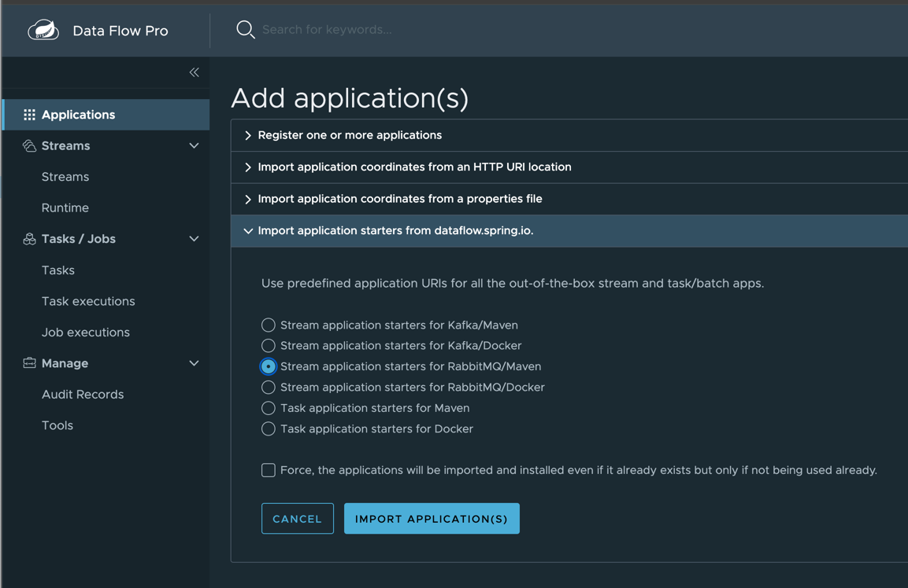

# MySQL to Postgres Upsert to Iceberg Sink Pipeline

Building Project
Download (first time only)

```shell
git clone https://github.com/ggreen/data-orchestration-with-scdf-showcase.git
cd data-orchestration-with-scdf-showcase
```
Build (first time only)

```shell
mvn -Dmaven.test.skip=true package
```
Create podman network (if it does not exist)

```shell
podman network create data-orchestration
```

Run RabbitMQ (guest/guest) if not running

```shell
deployment/local/podman/rabbit/start.sh
```

Infrastructure Setup (MySQL, Postgres, MinIO)
Start MySQL for Financial Trade Settlement records:

```shell
./deployment/local/mysql/start-mysql.sh 
```

Start Postgres for trade position updates/querys:

```shell
deployment/local/podman/postgres/start.sh
```

Start MinIO for Iceberg S3 Data Lake storage:

```shell
deployment/local/podman/s3/start-s3.sh
```


**Start Tanzu Data Flow or Spring Cloud DataFlow (Enterprise)**

- See https://techdocs.broadcom.com/us/en/vmware-tanzu/data-solutions/tanzu-data-flow/2-1/tdf-tanzu/getting-started.html


Financial Database Schema Setup
1. MySQL (Source Trade Settlements)
Connect to MySQL container:

```shell
podman exec -it mysql mysql -uroot -proot mysql
```

Create schema and insert sample Financial trade settlement data:

```SQL
CREATE TABLE trade_settlement (
    trade_id VARCHAR(64) NOT NULL,
    cusip VARCHAR(20) NOT NULL,
    participant_id VARCHAR(20) NOT NULL,
    shares INT NOT NULL,
    settlement_amount DECIMAL(15, 2) NOT NULL,
    settlement_status VARCHAR(20) NOT NULL,
    last_updated TIMESTAMP DEFAULT CURRENT_TIMESTAMP ON UPDATE CURRENT_TIMESTAMP,
    processed_flg VARCHAR(20) DEFAULT  NULL, 
    PRIMARY KEY (trade_id)
);

-- Insert Financial Trade Clearing Sample Data
INSERT INTO trade_settlement (trade_id, cusip, participant_id, shares, settlement_amount, settlement_status) 
VALUES 
('T-1001', '594918104', 'Financial-8821', 5000, 750000.00, 'PENDING'),
('T-1002', '037833100', 'Financial-4410', 12000, 2160000.00, 'SETTLED');
```

2. Postgres (Upsert Target for Real-Time Positions)
Connect to Postgres container:

```shell
podman exec -it postgresql psql -U postgres -d postgres
```

Create target schema and query table:

```SQL
CREATE SCHEMA IF NOT EXISTS financial;

CREATE TABLE financial.settlement_positions (
    trade_id VARCHAR(64) PRIMARY KEY,
    cusip VARCHAR(20) NOT NULL,
    participant_id VARCHAR(20) NOT NULL,
    shares INT NOT NULL,
    settlement_amount NUMERIC(15, 2) NOT NULL,
    settlement_status VARCHAR(20) NOT NULL,
    processed_at TIMESTAMP DEFAULT NOW()
);
```

3. MinIO 


[Open MinIO Web UI](http://127.0.0.1:9001)

RootUser: admin
RootPass: password123


4. Register Apps in Data Flow

Generate Register Script for jdbc Source (MySQL Reader):
Register JDBC Source:

Generate Register Script for postgres-query Processor:

```shell
echo app register --name postgres-query --type processor --bootVersion 3 --uri file://$PWD/applications/processors/postgres-query-processor/target/postgres-query-processor-0.0.1-SNAPSHOT.jar --metadataUri file://$PWD/applications/processors/postgres-query-processor/target/postgres-query-processor-0.0.1-SNAPSHOT-metadata.jar > runtime/scripts/postgres-query-processor.shell
cat runtime/scripts/postgres-query-processor.shell
```

Register Postgres Processor:

```shell
java -jar runtime/scdf/spring-cloud-dataflow-shell-2.11.5.jar --dataflow.uri=http://localhost:9393 --spring.shell.commandFile=runtime/scripts/postgres-query-processor.shell
```
Generate Register Script for iceberg Sink:

```shell
echo app register --name iceberg-s3-sink --type sink --bootVersion 3 --uri file://$PWD/applications/sinks/iceberg-s3-sink/target/iceberg-s3-sink-0.0.1-SNAPSHOT.jar --metadataUri file://$PWD/applications/sinks/iceberg-s3-sink/target/iceberg-s3-sink-0.0.1-SNAPSHOT-metadata.jar > runtime/scripts/iceberg-s3-sink-register.shell
cat runtime/scripts/iceberg-s3-sink-register.shell
```

Register Iceberg Sink:

```shell
java -jar runtime/scdf/spring-cloud-dataflow-shell-2.11.5.jar --dataflow.uri=http://localhost:9393 --spring.shell.commandFile=runtime/scripts/iceberg-s3-sink-register.shell
```

5. Open SCDF Dashboard

```shell
open http://localhost:9393/dashboard/index.html#/apps
```
Add Applications




Create stream

```shell
mysql-to-iceberg=jdbc --update="update trade_settlement set processed_flg = 'Y' where processed_flg IS NULL;" --query="SELECT *  FROM trade_settlement  WHERE processed_flg <> 'Y'     OR processed_flg IS NULL;" --password=root  --username=root --url="jdbc:mariadb://localhost:3306/mysql?allowPublicKeyRetrieval=true&useSSL=false" --spring.sql.init.platform=mysql  --fixed-delay=1000 | postgres-query --query.processor.sql="SELECT :trade_id as trade_id, :cusip as cusip, :shares as shares, :settlement_amount as settlement_amount, lower(:participant_id) as participant_id, lower(:settlement_status) as settlement_status, :last_updated as last_updated,:processed_flg as processed_flg;" --spring.datasource.username=postgres --spring.datasource.url="jdbc:postgresql://localhost:5432/postgres" | iceberg-s3-sink --server.port=9099 --spring.config.import="optional:file:/Users/Projects/solutions/Spring/data-flow/dev/data-orchestration-with-scdf-showcase/applications/sinks/iceberg-s3-sink/src/main/resources/application-finanicial-settlement.yml"
```


Send existing records

```sql
update trade_settlement set processed_flg = 'N';
```


Testing Data Pipeline Flow
1. Insert new Financial trade in MySQL
```SQL
INSERT INTO financial_clearing.trade_settlement (trade_id, cusip, participant_id, shares, settlement_amount, settlement_status) 
VALUES ('T-1003', '30231G102', 'Financial-9901', 8500, 1420000.00, 'PENDING');
```

2. Verify Upsert in Postgres
```SQL
SELECT * FROM financial.settlement_positions WHERE trade_id = 'T-1003';
```

3. Verify Lakehouse Record in Iceberg / MinIO

4. Check Iceberg metadata generated inside MinIO container:

